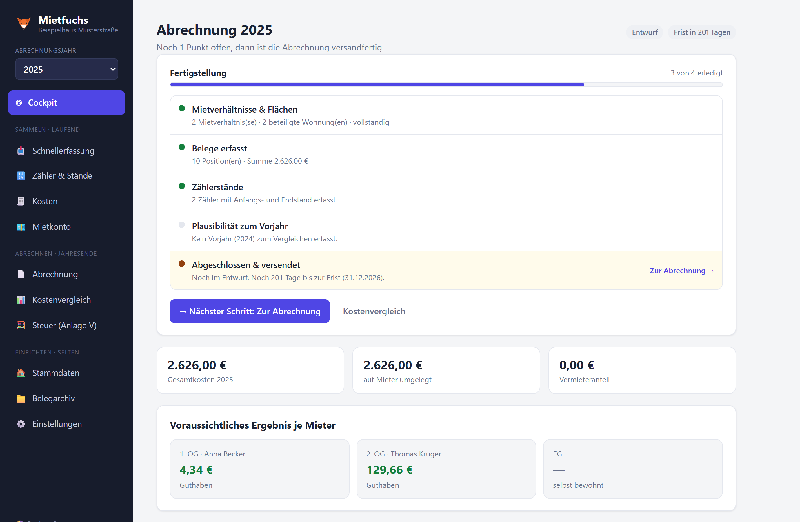
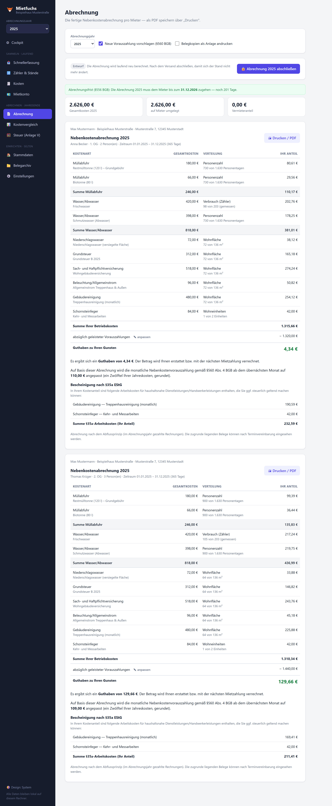
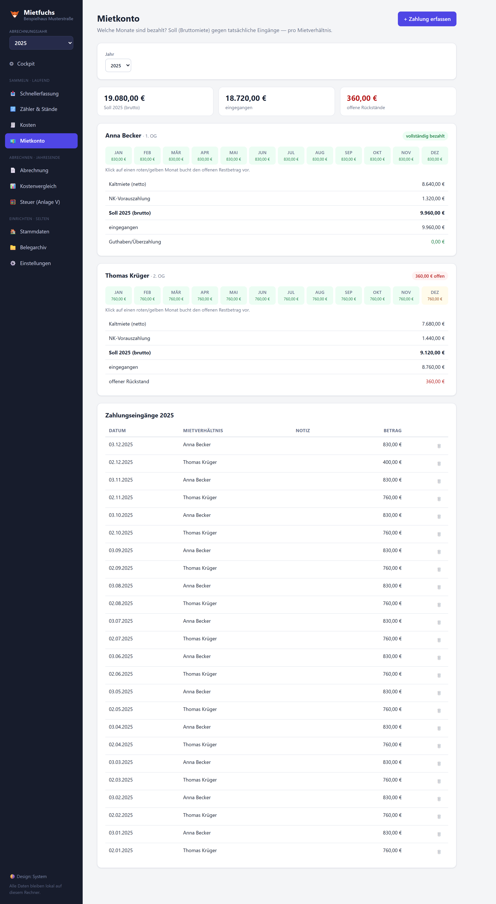
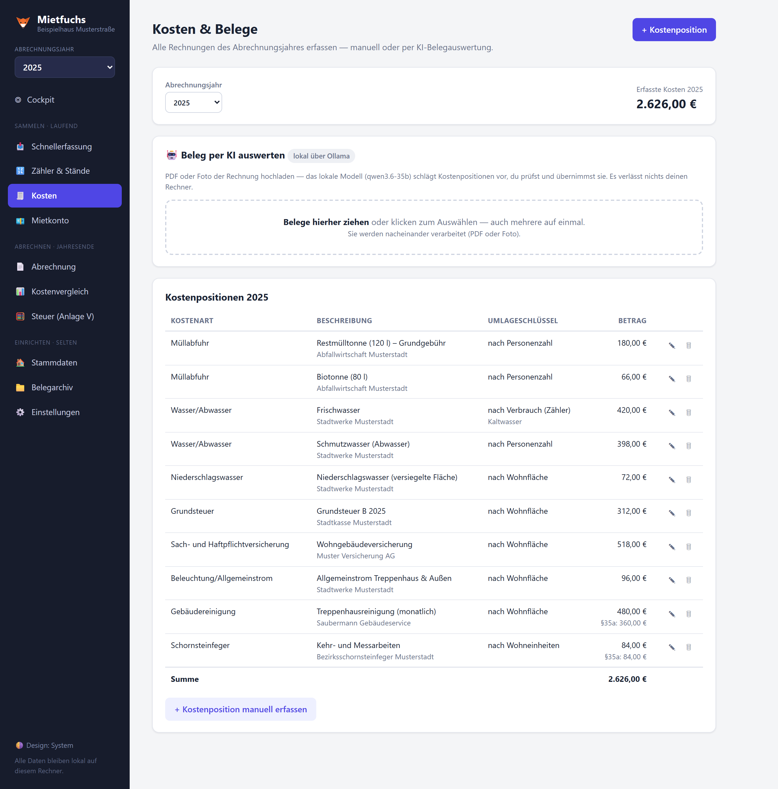
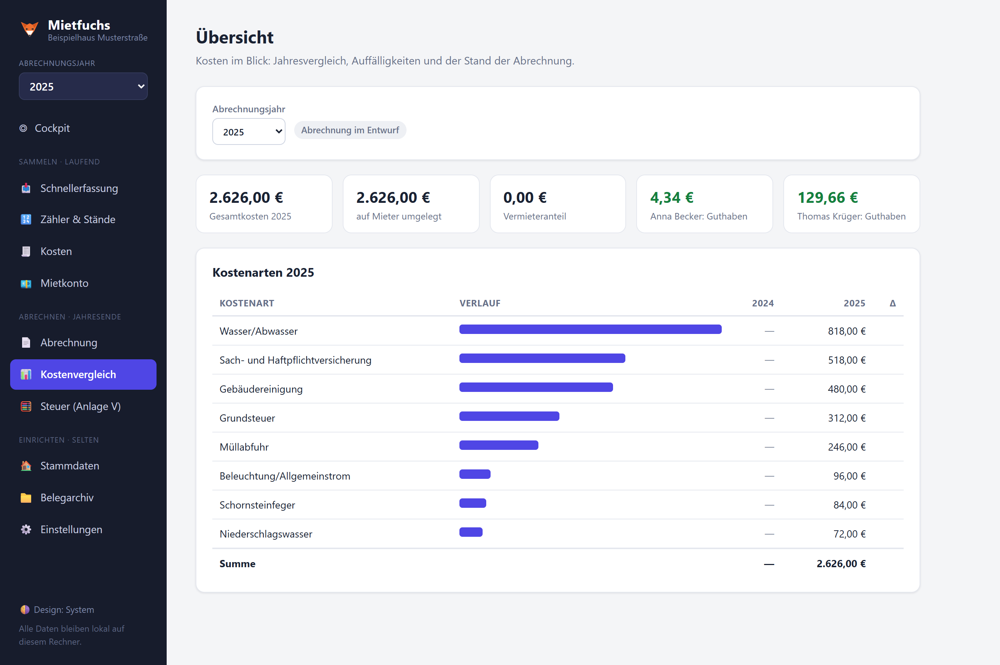
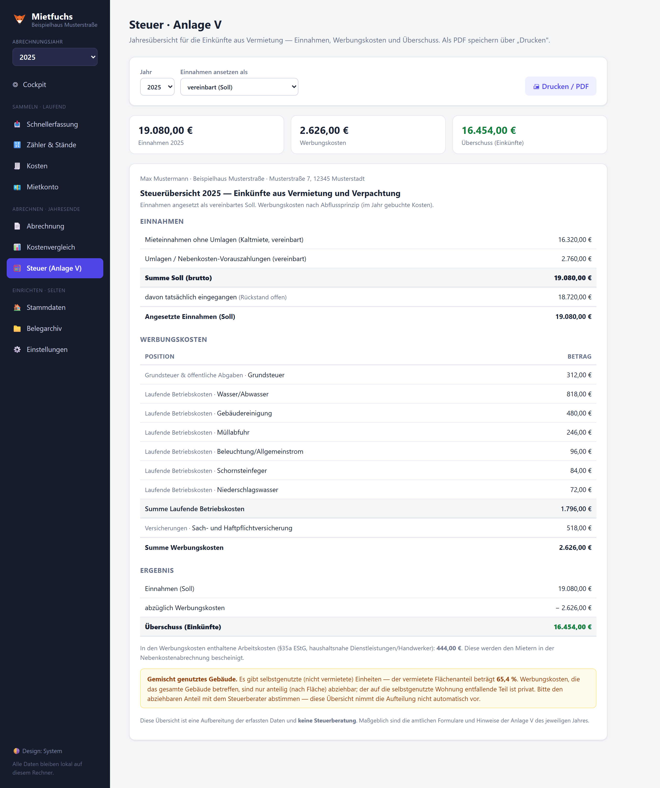
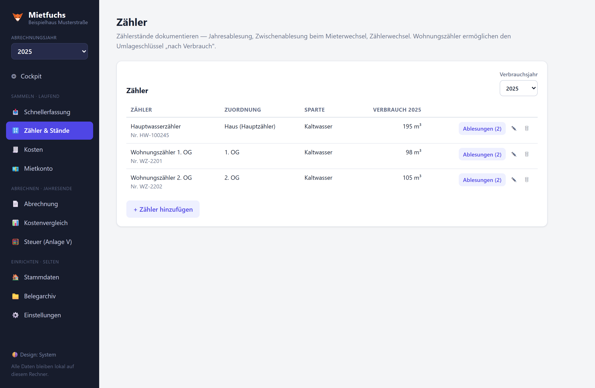

# 🦊 Mietfuchs

**Die Nebenkostenabrechnung für private Vermieter — komplett auf dem eigenen Rechner.
Keine Cloud, kein Konto, keine Abogebühren.**

[](LICENSE)
[](https://github.com/speedone/mietfuchs/releases/latest)


Mietfuchs nimmt dir die jährliche Betriebskostenabrechnung ab: Kosten und Belege erfassen
(optional per lokaler KI-Auswertung), Zählerstände pflegen — und am Jahresende eine fertige,
centgenau verteilte Abrechnung je Mieter ausdrucken, inklusive Mietkonto und Steuer-Übersicht
für die Anlage V. Alle Daten bleiben in einer lokalen Datei auf deinem Rechner.

### Highlights

- 🔒 **100 % lokal** — keine Cloud, kein Tracking, kein externer Dienst; Backup = Ordner kopieren
- 🧮 **Centgenaue Verteilung** nach Wohnfläche, Personenzahl, Wohneinheiten, Verbrauch oder direkt
- 📄 **Fertige Abrechnung** je Mieter mit Saldo, §35a-Bescheinigung und Fristen-Hinweis (§556/§560 BGB)
- 💶 **Mietkonto** — Soll/Ist je Monat, offene Rückstände auf einen Blick
- 🧾 **Steuer-Übersicht (Anlage V)** — Einnahmen, Werbungskosten und Überschuss aufs Jahr
- 🤖 **Optionale KI-Belegauswertung** gegen eine lokale [Ollama](https://ollama.com)-Instanz
- 🐳 **In Minuten startklar** — `npm run dev` oder `docker compose up`

## Screenshots

> Alle Abbildungen zeigen frei erfundene Beispieldaten („Beispielhaus Musterstraße 7, 12345
> Musterstadt") — keine echten Personen, Adressen oder Kontodaten.



| Abrechnung je Mieter | Mietkonto (Soll/Ist je Monat) |
| --- | --- |
| [](docs/screenshots/abrechnung.png) | [](docs/screenshots/mietkonto.png) |

| Kosten & Belege | Kostenvergleich |
| --- | --- |
| [](docs/screenshots/kosten.png) | [](docs/screenshots/kostenvergleich.png) |

| Steuer-Übersicht (Anlage V) | Zähler & Stände |
| --- | --- |
| [](docs/screenshots/steuer.png) | [](docs/screenshots/zaehler.png) |

<sub>Weitere Ansicht: [Stammdaten](docs/screenshots/stammdaten.png).</sub>

## Herunterladen & starten (ohne Installation)

Der einfachste Weg — **keine Installation, kein Node nötig**. Auf der
[**Releases-Seite**](https://github.com/speedone/mietfuchs/releases/latest) die passende Datei
für dein System laden:

| System | Datei |
| --- | --- |
| Windows | `mietfuchs-win.exe` |
| macOS (Apple Silicon, M1–M4) | `mietfuchs-macos-apple-silicon` |
| macOS (Intel) | `mietfuchs-macos-intel` |
| Linux | `mietfuchs-linux` |

Datei per **Doppelklick** starten — es öffnet sich automatisch dein Browser mit Mietfuchs.
Das Programmfenster (die schwarze Konsole) offen lassen, solange du arbeitest; zum Beenden
einfach schließen.

Beim ersten Start meldet sich das Betriebssystem, weil die Datei nicht kostenpflichtig
signiert ist:

- **Windows** — „Der Computer wurde durch Windows geschützt" → *Weitere Informationen* →
  *Trotzdem ausführen*.
- **macOS** — Rechtsklick auf die Datei → *Öffnen* → im Dialog nochmals *Öffnen*.
- **Linux** — einmalig ausführbar machen: `chmod +x mietfuchs-linux`, dann starten.

Deine Daten liegen im Ordner **`data/` direkt neben der Programmdatei** (`db.json` + Belege).
Backup = diesen Ordner kopieren. Die optionale [KI-Belegauswertung](#ki-belegauswertung-optional)
braucht zusätzlich ein separat installiertes [Ollama](https://ollama.com) — ohne das
funktioniert die Abrechnung trotzdem vollständig.

## Aus dem Quellcode starten (für Entwickler)

```powershell
npm install        # einmalig: installiert Server + Client
npm run dev        # startet Server (Port 3001) und Oberfläche (http://localhost:5173)
```

Tests der Berechnungs-Engine: `npm test`

Eigenständige Binaries selbst bauen (benötigt [Bun](https://bun.com)): `npm run package` →
legt die Dateien für alle Plattformen in `dist-bin/` ab.

## Funktionsweise

1. **Stammdaten**: Haus, alle Wohnungen (auch die selbstgenutzte — sie wird als „nicht an der
   Kostenverteilung beteiligt" markiert) und Mietverhältnisse. Personenzahl und Vorauszahlung
   werden als **Staffel** geführt („ab X gilt Y") — Geburt, Auszug einzelner Personen oder
   Vorauszahlungs-Erhöhungen brauchen kein neues Mietverhältnis.
2. **Kosten & Belege**: Rechnungen pro Abrechnungsjahr erfassen — manuell oder per
   KI-Belegauswertung. Eine Rechnung kann in mehrere Positionen mit unterschiedlichen
   Umlageschlüsseln zerlegt werden (z. B. Wasserrechnung: Grundgebühr + Verbrauch).
   Optional pro Position: **Lohnanteil nach §35a EStG** (wird dem Mieter bescheinigt).
3. **Zähler**: Zähler (Haupt- und Wohnungszähler) mit Ablesungen — Jahresablesung,
   Zwischenablesung beim Mieterwechsel (exakte Aufteilung), Zählerwechsel (Endstand alt +
   Startstand neu) mit Plausibilitätswarnung bei negativem Verbrauch.
4. **Abrechnung**: Pro Mieter die fertige Abrechnung mit Kostenaufstellung, Umlageschlüssel,
   Vorauszahlungen, Saldo, Zahlungsaufforderung (IBAN/Frist aus den Einstellungen),
   §35a-Bescheinigung und Vorschlag zur Vorauszahlungsanpassung (§560 BGB). Dazu eine
   Erinnerung an die 12-Monats-Abrechnungsfrist (§556 BGB). Über „Drucken / PDF" speichern.
5. **Mietkonto**: Welche Monate sind bezahlt? Die Kaltmiete wird (wie die Vorauszahlung) als
   Staffel geführt; **Soll = Bruttomiete = Kaltmiete + NK-Vorauszahlung**. Erfasste
   Zahlungseingänge füllen die Monate der Reihe nach — ein Monatsraster zeigt *bezahlt /
   teilweise / offen*, dazu Brutto/Netto-Aufschlüsselung und offene Rückstände je Mieter.
6. **Steuer (Anlage V)**: Jahresübersicht der Einkünfte aus Vermietung — Einnahmen (Kaltmiete +
   Umlagen, wahlweise als vereinbartes Soll oder tatsächlich gezahlt/Zuflussprinzip),
   Werbungskosten nach Anlage-V-Gruppen sowie der Überschuss. Bei gemischt genutztem Gebäude
   wird der vermietete Flächenanteil ausgewiesen (Hinweis, dass der selbstgenutzte Teil nicht
   abziehbar ist). Druckbar als PDF. Erweiterte Stammdaten (Kontakt, Kaution, Vertragsdatum,
   Zimmer/Etage) lassen sich optional je Mieter und Wohnung hinterlegen.

### Umlageschlüssel

- **Wohnfläche** (gesetzlicher Standard nach §556a BGB)
- **Personenzahl** (personentagesgenau, inkl. Personen-Staffel)
- **Wohneinheiten**
- **Verbrauch (Zähler)** — Anteil = Verbrauch der Wohnung ÷ Summe aller Wohnungszähler;
  nur wählbar, wenn Wohnungszähler existieren
- **Direktzuordnung** an eine Wohnung

Korrekturen der tatsächlich gezahlten Vorauszahlungen (z. B. ausgefallene Zahlung) direkt
in der Abrechnung über „✎ anpassen".

Verteilt wird nur auf Wohnungen, die als „beteiligt" markiert sind. Zeiträume ohne Mieter
(Leerstand) sowie Positionen der Kategorie „Nicht umlagefähig" trägt der Vermieter. Alle
Beträge werden intern in Cent gerechnet und centgenau verteilt (Hare-Verfahren).

Die Abrechnung folgt dem **Abflussprinzip**: Eine Kostenposition gehört zu dem Jahr, dem sie
beim Erfassen zugeordnet wird (in der Regel das Zahlungsjahr).

### KI-Belegauswertung (optional)

Unter *Einstellungen* eine lokale [Ollama](https://ollama.com)-Instanz konfigurieren
(Standard: `http://localhost:11434`, Modell `qwen3.6-35b`). PDFs mit Textebene funktionieren
mit jedem Sprachmodell; fotografierte Belege benötigen ein Vision-Modell. Die KI macht nur
Vorschläge — übernommen wird erst nach manueller Prüfung.

## Daten & Backup

Alles liegt in einem `data/`-Ordner (`db.json` + hochgeladene Belege in `uploads/`).
Bei der heruntergeladenen Programmdatei liegt er **neben der Datei**, beim Start aus dem
Quellcode unter `server/data/`. Backup = diesen Ordner kopieren.

## Produktivbetrieb ohne Dev-Server

```powershell
npm run build      # baut das Frontend nach client/dist
npm start          # Server liefert App + API auf http://localhost:3001
```

## Mit Docker

Voraussetzung: [Docker](https://docs.docker.com/get-docker/) installiert (Docker Desktop unter
Windows/macOS, Docker Engine unter Linux). Ein einziges Image baut das Frontend und liefert
App + API auf Port 3001; die Daten (`db.json` + Belege) liegen im benannten Volume
`mietfuchs-data` und überleben Updates des Containers.

Am einfachsten mit **Docker Compose** (Konfiguration in [`docker-compose.yml`](docker-compose.yml)):

```bash
docker compose up -d        # Image bauen + Container starten (im Hintergrund)
# App: http://localhost:3001
docker compose down         # stoppen — das Volume mit den Daten bleibt erhalten
```

Ohne Compose geht es auch direkt:

```bash
docker build -t mietfuchs .
docker run -d -p 3001:3001 -v mietfuchs-data:/app/server/data --name mietfuchs mietfuchs
```

Die optionale KI-Belegauswertung erwartet eine Ollama-Instanz. Läuft sie auf dem Host,
in den Einstellungen `http://host.docker.internal:11434` eintragen (statt `localhost`).

## Lizenz & Haftung

[MIT-Lizenz](LICENSE). Das Tool unterstützt bei der Erstellung der Abrechnung, ist aber
**keine Rechts- oder Steuerberatung**; die fachliche und rechtliche Prüfung der Ergebnisse
bleibt beim Vermieter. Nutzung auf eigene Verantwortung.
