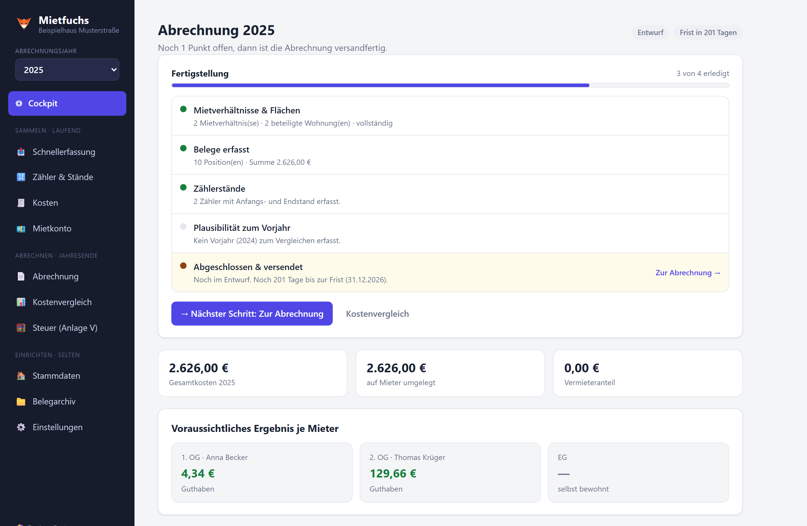
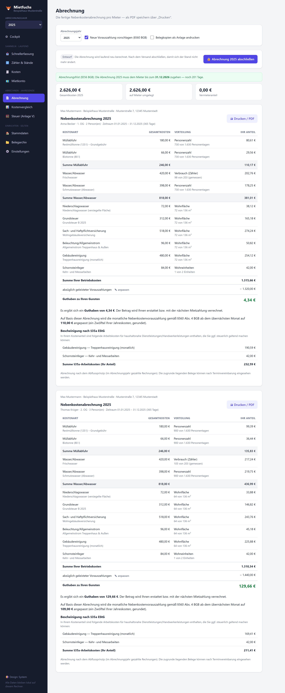
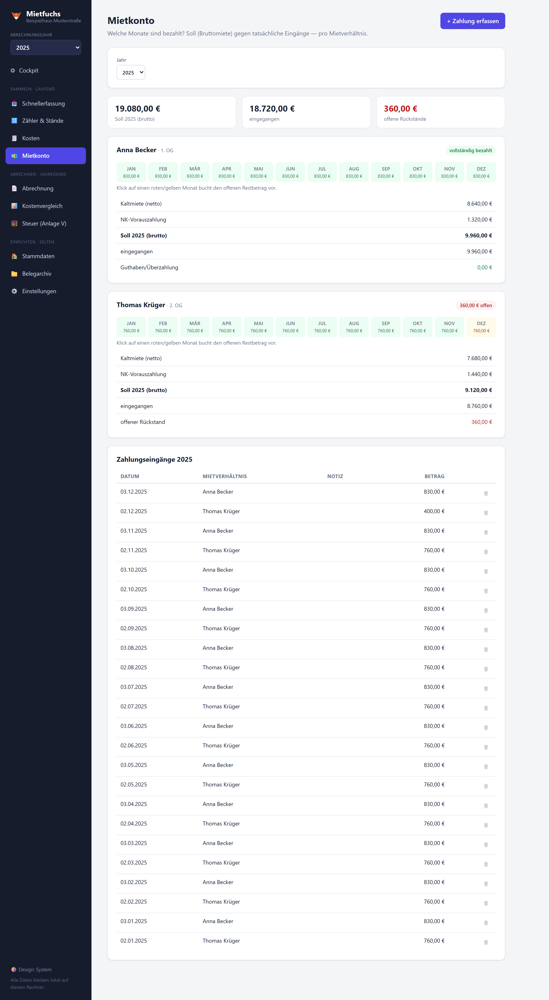
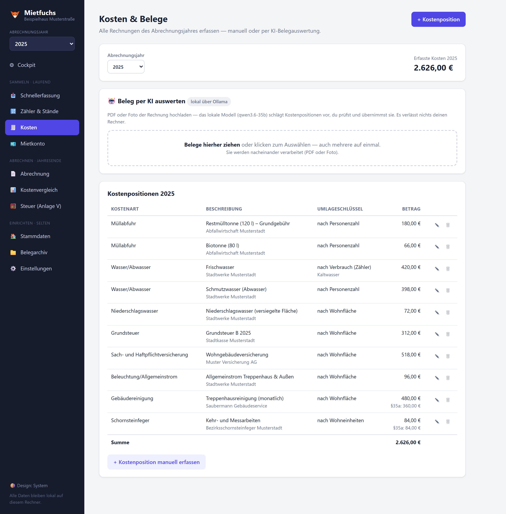
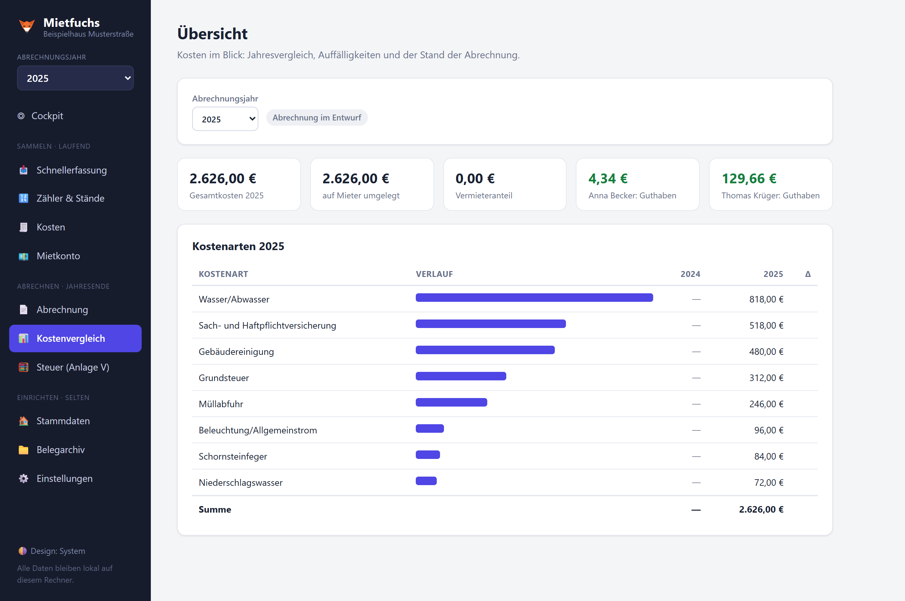
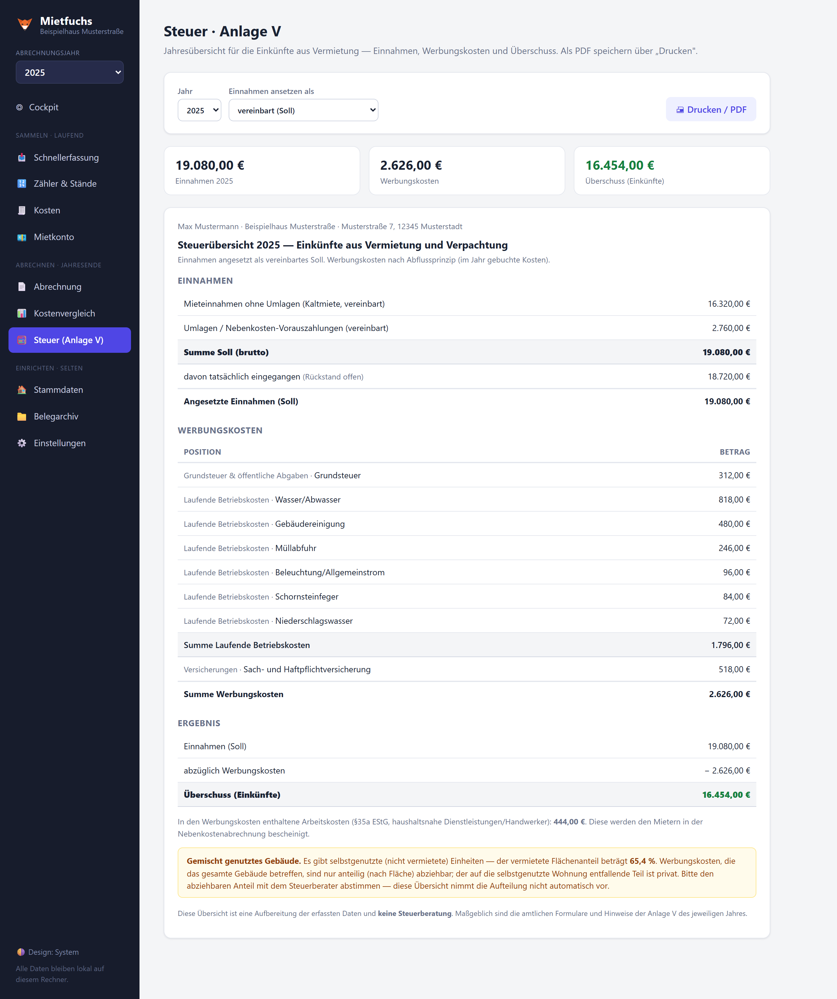
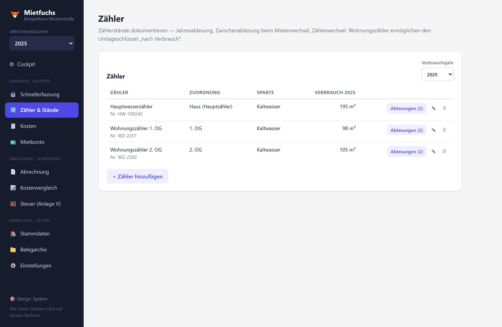

# 🦊 Mietfuchs

**Die Nebenkostenabrechnung für private Vermieter — komplett auf dem eigenen Rechner.
Keine Cloud, kein Konto, keine Abogebühren.**

[](LICENSE)
[](https://github.com/speedone/mietfuchs/releases/latest)


Mietfuchs nimmt dir die jährliche Betriebskostenabrechnung ab: Kosten und Belege erfassen
(optional per lokaler KI-Auswertung), Zählerstände pflegen — und am Jahresende eine fertige,
centgenau verteilte Abrechnung je Mieter ausdrucken, inklusive Mietkonto und Steuer-Übersicht
für die Anlage V. Alle Daten bleiben in einer lokalen Datei auf deinem Rechner.

### Highlights

- 🔒 **100 % lokal** — keine Cloud, kein Tracking, kein externer Dienst (außer der Update-Prüfung, wenn du sie erlaubst); Backup = Ordner kopieren
- 🧮 **Centgenaue Verteilung** nach Wohnfläche, Personenzahl, Wohneinheiten, Verbrauch oder direkt
- 📄 **Fertige Abrechnung** je Mieter mit Saldo, §35a-Bescheinigung und Fristen-Hinweis (§556/§560 BGB)
- 💶 **Mietkonto** — Soll/Ist je Monat, offene Rückstände auf einen Blick
- 🧾 **Steuer-Übersicht (Anlage V)** — Einnahmen, Werbungskosten und Überschuss aufs Jahr
- 🤖 **Optionale KI-Belegauswertung** gegen eine lokale [Ollama](https://ollama.com)-Instanz
- 🐳 **In Minuten startklar** — `npm run dev` oder `docker compose up`

## Screenshots

> Alle Abbildungen zeigen frei erfundene Beispieldaten („Beispielhaus Musterstraße 7, 12345
> Musterstadt") — keine echten Personen, Adressen oder Kontodaten.



| Abrechnung je Mieter | Mietkonto (Soll/Ist je Monat) |
| --- | --- |
| [](docs/screenshots/abrechnung.png) | [](docs/screenshots/mietkonto.png) |

| Kosten & Belege | Kostenvergleich |
| --- | --- |
| [](docs/screenshots/kosten.png) | [](docs/screenshots/kostenvergleich.png) |

| Steuer-Übersicht (Anlage V) | Zähler & Stände |
| --- | --- |
| [](docs/screenshots/steuer.png) | [](docs/screenshots/zaehler.png) |

<sub>Weitere Ansicht: [Stammdaten](docs/screenshots/stammdaten.png).</sub>

## Herunterladen & starten (ohne Installation)

Der einfachste Weg — **keine Installation, kein Node nötig**. Auf der
[**Releases-Seite**](https://github.com/speedone/mietfuchs/releases/latest) die passende Datei
für dein System laden:

| System | Datei |
| --- | --- |
| Windows | `mietfuchs-win.exe` |
| Windows auf ARM (z. B. Snapdragon) | `mietfuchs-win-arm64.exe` |
| macOS (Apple Silicon, M1–M4) | `mietfuchs-macos-apple-silicon.zip` |
| macOS (Intel) | `mietfuchs-macos-intel.zip` |
| Linux | `mietfuchs-linux.tar.gz` |
| Linux auf ARM (z. B. Raspberry Pi 4/5 mit 64-Bit-System) | `mietfuchs-linux-arm64.tar.gz` |

Voraussetzungen: Windows 10 (1809) oder neuer, macOS 13 oder neuer, Linux mit glibc 2.17 oder
neuer. Das sind praktisch alle gängigen Distributionen; vor jedem Release startet jede Datei
testweise auf ihrem System und Linux zusätzlich auf Debian, Ubuntu, Fedora, AlmaLinux, Rocky,
openSUSE, Arch und CentOS 7. Für Alpine und andere musl-Systeme gibt es das Docker-Image.

Archiv entpacken (unter macOS genügt ein Doppelklick), dann die Programmdatei per
**Doppelklick** starten — es öffnet sich automatisch dein Browser mit Mietfuchs.
Das Programmfenster (die schwarze Konsole) offen lassen, solange du arbeitest; zum Beenden
einfach schließen.

Beim ersten Start meldet sich das Betriebssystem, weil die Datei nicht kostenpflichtig
signiert ist:

- **Windows** — „Der Computer wurde durch Windows geschützt" → *Weitere Informationen* →
  *Trotzdem ausführen*.
- **macOS** — der erste Start wird blockiert: Dialog schließen, dann in
  *Systemeinstellungen → Datenschutz & Sicherheit* unten bei der Mietfuchs-Meldung auf
  *Dennoch öffnen* klicken und den Start wiederholen. Bis macOS 14 geht stattdessen
  Rechtsklick auf die Datei → *Öffnen* → im Dialog nochmals *Öffnen*. Wer das Terminal mag,
  nimmt den Einzeiler `xattr -d com.apple.quarantine mietfuchs-macos-*`.
- **Linux** — im Terminal: `tar -xzf mietfuchs-linux.tar.gz && ./mietfuchs-linux`
  (das Archiv erhält die Ausführungsrechte, `chmod` ist nicht nötig).

Deine Daten liegen im Ordner **`data/` direkt neben der Programmdatei** (`db.json` + Belege).
Backup = diesen Ordner kopieren. Die optionale [KI-Belegauswertung](#ki-belegauswertung-mit-ollama)
braucht zusätzlich ein separat installiertes [Ollama](https://ollama.com) — ohne das
funktioniert die Abrechnung trotzdem vollständig.

## Aus dem Quellcode starten (für Entwickler)

```powershell
npm install        # einmalig: installiert Server + Client
npm run dev        # startet Server (Port 3001) und Oberfläche (http://localhost:5173)
```

Tests der Berechnungs-Engine: `npm test`

Eigenständige Binaries selbst bauen (benötigt [Bun](https://bun.com)): `npm run package` →
legt die Dateien für alle Plattformen in `dist-bin/` ab.

## Funktionsweise

1. **Stammdaten**: Haus, alle Wohnungen (auch die selbstgenutzte — sie wird als „nicht an der
   Kostenverteilung beteiligt" markiert) und Mietverhältnisse. Personenzahl und Vorauszahlung
   werden als **Staffel** geführt („ab X gilt Y") — Geburt, Auszug einzelner Personen oder
   Vorauszahlungs-Erhöhungen brauchen kein neues Mietverhältnis.
2. **Kosten & Belege**: Rechnungen pro Abrechnungsjahr erfassen — manuell oder per
   KI-Belegauswertung. Eine Rechnung kann in mehrere Positionen mit unterschiedlichen
   Umlageschlüsseln zerlegt werden (z. B. Wasserrechnung: Grundgebühr + Verbrauch).
   Optional pro Position: **Lohnanteil nach §35a EStG** (wird dem Mieter bescheinigt).
3. **Zähler**: Zähler (Haupt- und Wohnungszähler) mit Ablesungen — Jahresablesung,
   Zwischenablesung beim Mieterwechsel (exakte Aufteilung), Zählerwechsel (Endstand alt +
   Startstand neu) mit Plausibilitätswarnung bei negativem Verbrauch.
4. **Abrechnung**: Pro Mieter die fertige Abrechnung mit Kostenaufstellung, Umlageschlüssel,
   Vorauszahlungen, Saldo, Zahlungsaufforderung (IBAN/Frist aus den Einstellungen),
   §35a-Bescheinigung und Vorschlag zur Vorauszahlungsanpassung (§560 BGB). Dazu eine
   Erinnerung an die 12-Monats-Abrechnungsfrist (§556 BGB). Über „Drucken / PDF" speichern.
5. **Mietkonto**: Welche Monate sind bezahlt? Die Kaltmiete wird (wie die Vorauszahlung) als
   Staffel geführt; **Soll = Bruttomiete = Kaltmiete + NK-Vorauszahlung**. Erfasste
   Zahlungseingänge füllen die Monate der Reihe nach — ein Monatsraster zeigt *bezahlt /
   teilweise / offen*, dazu Brutto/Netto-Aufschlüsselung und offene Rückstände je Mieter.
6. **Steuer (Anlage V)**: Jahresübersicht der Einkünfte aus Vermietung — Einnahmen (Kaltmiete +
   Umlagen, wahlweise als vereinbartes Soll oder tatsächlich gezahlt/Zuflussprinzip),
   Werbungskosten nach Anlage-V-Gruppen sowie der Überschuss. Bei gemischt genutztem Gebäude
   wird der vermietete Flächenanteil ausgewiesen (Hinweis, dass der selbstgenutzte Teil nicht
   abziehbar ist). Druckbar als PDF. Erweiterte Stammdaten (Kontakt, Kaution, Vertragsdatum,
   Zimmer/Etage) lassen sich optional je Mieter und Wohnung hinterlegen.

### Umlageschlüssel

- **Wohnfläche** (gesetzlicher Standard nach §556a BGB)
- **Personenzahl** (personentagesgenau, inkl. Personen-Staffel)
- **Wohneinheiten**
- **Verbrauch (Zähler)** — Anteil = Verbrauch der Wohnung ÷ Summe aller Wohnungszähler;
  nur wählbar, wenn Wohnungszähler existieren
- **Direktzuordnung** an eine Wohnung

Korrekturen der tatsächlich gezahlten Vorauszahlungen (z. B. ausgefallene Zahlung) direkt
in der Abrechnung über „✎ anpassen".

Verteilt wird nur auf Wohnungen, die als „beteiligt" markiert sind. Zeiträume ohne Mieter
(Leerstand) sowie Positionen der Kategorie „Nicht umlagefähig" trägt der Vermieter. Alle
Beträge werden intern in Cent gerechnet und centgenau verteilt (Hare-Verfahren).

Die Abrechnung folgt dem **Abflussprinzip**: Eine Kostenposition gehört zu dem Jahr, dem sie
beim Erfassen zugeordnet wird (in der Regel das Zahlungsjahr).

## KI-Belegauswertung mit Ollama

Optional. Mietfuchs kann hochgeladene Belege von einem KI-Modell lesen lassen, das auf deinem
eigenen Rechner läuft ([Ollama](https://ollama.com)). Das Modell schlägt Positionen, Beträge
und Kostenarten vor, übernommen wird erst, was du geprüft hast. Die Belege verlassen dabei
deinen Rechner nicht. Ohne KI funktioniert Mietfuchs vollständig.

### Einrichten

1. **Ollama installieren** von [ollama.com/download](https://ollama.com/download) (Windows,
   macOS, Linux). Danach läuft Ollama im Hintergrund.
2. **Ein Modell laden**, im Terminal `ollama pull qwen3.5:4b` (voreingestellt). Welches Modell
   passt, steht unten. Der Download ist 3,4 GB groß.
3. **In Mietfuchs prüfen:** *Einstellungen*, Karte „KI-Belegauswertung mit Ollama“. Mietfuchs
   findet Ollama unter `http://localhost:11434` selbst und listet die installierten Modelle
   auf, jeweils mit Größe und ob es Bilder versteht. Modell wählen und speichern. Antwortet
   Ollama unter einer anderen üblichen Adresse, schlägt Mietfuchs sie zur Übernahme vor.
4. **Ausprobieren:** unter *Kosten* oder in der *Schnellerfassung* einen Beleg in die Fläche
   ziehen.

PDFs mit Textebene liest jedes Sprachmodell. Gescannte PDFs und Fotos brauchen ein Modell,
das Bilder versteht. Bei Scans schickt der Browser die ersten vier Seiten als Bilder mit. Ein
Modell ohne Bildverständnis bekommt keine Bilder, Mietfuchs meldet das stattdessen.

### Welches Modell?

Voreingestellt ist `qwen3.5:4b`. Die Übersicht zeigt, wie gut einige Modelle frei erfundene
Beispielbelege gelesen haben und wie lange sie im Schnitt brauchten. Gemessen hat das der
[KI-Prüflauf](.github/workflows/ai-eval.yml) auf einem Rechner ohne Grafikkarte mit 4
Prozessorkernen und 16 GB Arbeitsspeicher, Stand September 2026. Ein üblicher Laptop ist meist
etwas schneller.

| Modell | Arbeitsspeicher | PDF mit Textebene | Scan | Handyfoto |
| --- | --- | --- | --- | --- |
| `qwen3.5:4b` (voreingestellt) | 3,6 GB | 93 %, 2 Min. | 75 %, 6 Min. | 56 %, 4,5 Min. |
| `gemma4:12b` | 9,2 GB | 95 %, 5,5 Min. | 83 %, 6,5 Min. | 92 %, 5 Min. |
| `minicpm-v4.5:8b` | 7,8 GB | 86 %, 2 Min. | 64 %, 6,5 Min. | 61 %, 5 Min. |

Die Prozentzahl ist der Anteil richtig gelesener Angaben: Summe, Aussteller, Beträge,
Kostenarten und §35a-Anteil. Wer vor allem Fotos und Scans auswertet und genug
Arbeitsspeicher hat, nimmt `gemma4:12b`. Kleinere Modelle lasen die Belege in der Messung
deutlich schlechter. Mit Grafikkarte kommen auch größere Modelle in Frage, etwa
`qwen3.6:35b` (23 GB). Ein anderes Modell wählst du in den Einstellungen, auch eines, das
nicht in dieser Liste steht.

### Wie lange dauert das?

Auf einem Rechner ohne Grafikkarte rechnet das Modell auf dem Prozessor. Ein PDF mit Textebene
braucht dann meist unter einer Minute, ein gescannter Beleg einige Minuten. Mit Grafikkarte
oder auf einem Mac mit Apple-Chip geht es deutlich schneller. Während der Auswertung zeigt
Mietfuchs, was das Modell gerade tut und wie lange es schon läuft. Abbrechen stoppt auch das
Modell.

### Ollama und Docker

Läuft Ollama auf dem Rechner, auf dem auch Docker läuft, ist es aus dem Container unter
`http://host.docker.internal:11434` erreichbar. Mietfuchs schlägt diese Adresse in den
Einstellungen selbst vor.

Mit der [`docker-compose.yml`](docker-compose.yml) aus dem Repo läuft Ollama auch als eigener
Container mit:

```bash
docker compose --profile ki up -d        # startet Mietfuchs und Ollama, lädt das Modell einmalig
docker compose logs -f ollama-pull       # Fortschritt des Downloads
```

Danach in den Einstellungen die gefundene Adresse `http://ollama:11434` übernehmen. Ein
weiteres Modell lädt `docker compose exec ollama ollama pull NAME`, den passenden Befehl zeigt
Mietfuchs auch selbst an. Der Container rechnet auf dem Prozessor. Für eine NVIDIA-Grafikkarte
beschreibt die [Ollama-Dokumentation zu Docker](https://github.com/ollama/ollama/blob/main/docs/docker.mdx),
was nötig ist. Docker Desktop auf dem Mac hat keinen Zugriff auf die Grafik des Apple-Chips,
dort ist die Ollama-App die bessere Wahl.

### Für Fortgeschrittene

Umgebungsvariablen, etwa in einer `.env`-Datei neben der `docker-compose.yml`:

| Variable | Wirkung |
| --- | --- |
| `NKA_OLLAMA_URL` | Adresse von Ollama fest vorgeben. Das Feld in den Einstellungen ist dann gesperrt. |
| `NKA_OLLAMA_MODEL` | Modell fest vorgeben, ebenfalls gesperrt. Im Compose-Profil lädt `ollama-pull` dieses Modell. |
| `NKA_OLLAMA_NUM_CTX` | Kontextgröße in Token, Standard 16384. Kleiner spart Arbeitsspeicher, zu klein schneidet lange Belege ab. |
| `NKA_AI_TIMEOUT` | Zeitlimit je Auswertungsschritt in Sekunden, Standard 1200 für das Auslesen. |

## Daten & Backup

Alles liegt in einem `data/`-Ordner (`db.json` + hochgeladene Belege in `uploads/`).
Bei der heruntergeladenen Programmdatei liegt er **neben der Datei**, beim Start aus dem
Quellcode unter `server/data/`. Backup = diesen Ordner kopieren.

## Produktivbetrieb ohne Dev-Server

```powershell
npm run build      # baut das Frontend nach client/dist
npm start          # Server liefert App + API auf http://localhost:3001
```

## Mit Docker

Voraussetzung: [Docker](https://docs.docker.com/get-docker/) installiert (Docker Desktop unter
Windows/macOS, Docker Engine unter Linux). Ein einziges Image liefert App + API auf Port 3001;
die Daten (`db.json` + Belege) liegen im benannten Volume `mietfuchs-data` und überleben
Updates des Containers.

### Fertiges Image (ohne Clone)

Das Image liegt in der GitHub Container Registry für `linux/amd64` und `linux/arm64`
(Apple Silicon, Raspberry Pi):

```bash
docker run -d -p 3001:3001 -v mietfuchs-data:/app/server/data \
  --name mietfuchs ghcr.io/speedone/mietfuchs:latest
# App: http://localhost:3001
```

Als Compose-Datei — reicht allein, das Repo braucht man dafür nicht:

```yaml
services:
  mietfuchs:
    image: ghcr.io/speedone/mietfuchs:latest
    ports: ["3001:3001"]
    volumes: ["mietfuchs-data:/app/server/data"]
    restart: unless-stopped
    extra_hosts: ["host.docker.internal:host-gateway"]  # für Ollama auf dem Host
volumes:
  mietfuchs-data:
```

Aktualisieren: `docker compose pull && docker compose up -d`. Mit `docker run` gestartet:
`docker pull ghcr.io/speedone/mietfuchs:latest`, dann `docker rm -f mietfuchs` und den
`docker run`-Befehl von oben erneut ausführen. Die Daten im Volume bleiben dabei erhalten.
Statt `latest` lässt sich auch eine feste Version festhalten, z. B.
`ghcr.io/speedone/mietfuchs:0.3.0`.

### Selbst bauen (aus dem Clone)

Mit **Docker Compose** (Konfiguration in [`docker-compose.yml`](docker-compose.yml)):

```bash
docker compose up -d        # Image bauen + Container starten (im Hintergrund)
# App: http://localhost:3001
docker compose down         # stoppen — das Volume mit den Daten bleibt erhalten
```

Aktualisieren: `git pull && docker compose up -d --build`.

Ohne Compose geht es auch direkt:

```bash
docker build -t mietfuchs .
docker run -d -p 3001:3001 -v mietfuchs-data:/app/server/data --name mietfuchs mietfuchs
```

Für die optionale KI-Belegauswertung siehe [KI-Belegauswertung mit Ollama](#ki-belegauswertung-mit-ollama),
dort auch das Compose-Profil `ki`, das Ollama als eigenen Container mitstartet.

## Lizenz & Haftung

[MIT-Lizenz](LICENSE). Das Tool unterstützt bei der Erstellung der Abrechnung, ist aber
**keine Rechts- oder Steuerberatung**; die fachliche und rechtliche Prüfung der Ergebnisse
bleibt beim Vermieter. Nutzung auf eigene Verantwortung.
